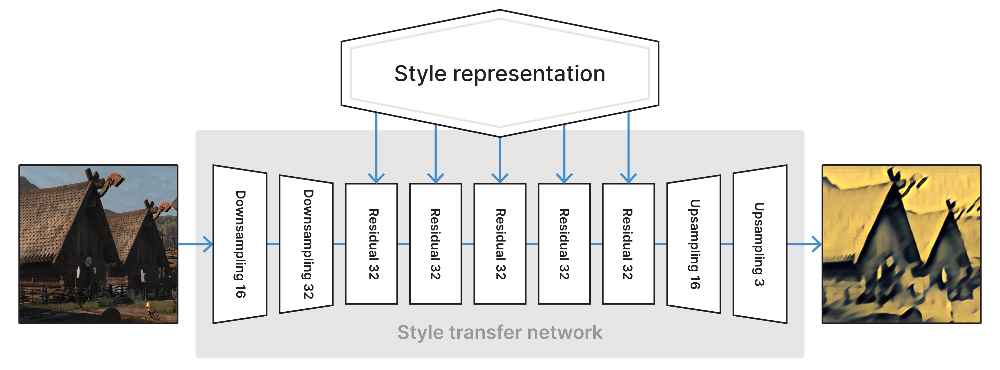
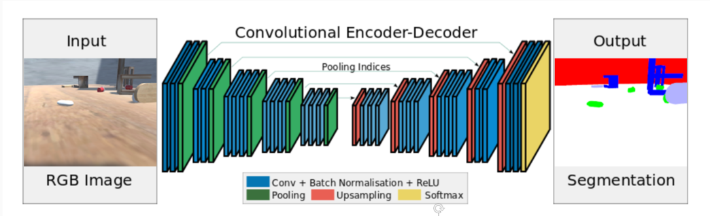

# Idea for Creative Coding 2 - final project

## Ideas

Interested: **ML** in creating **Shader**

Theme:

1. Recognize **YOGA movements** & pose then to create shader -> the mandala / flower / or other natural things
2. Ocean Protection; create waves and water

## Reference

- Paper - Deep Shading: Convolutional Neural Networks for Screen-Space Shading: https://arxiv.org/pdf/1603.06078.pdf
- Real-time style transfer in Unity using deep neural networks：https://blogs.unity3d.com/2020/11/25/real-time-style-transfer-in-unity-using-deep-neural-networks/
  - At Unity, we aim to propose seamless integration of CNN inference in the 3D rendering pipeline.
  - 
- shader in unity(vr) 实例: https://github.com/SCRN-VRC/SimpNet-Deep-Learning-in-a-Shader
- 好厉害，好详细的一个blog post，on an example using CV in unity game: https://dtransposed.github.io/blog/GEAR.html
  - 
- Ml in shader的tutorial：https://ai.darienbrito.com/2019/03/10/mlinshaderspreface/
